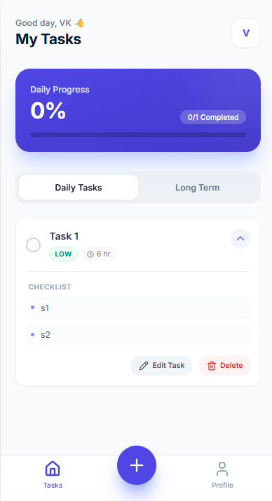

# TaskFlow - AI Powered To-Do App

TaskFlow is a modern, mobile-first task management application designed to bridge the gap between daily to-do lists and long-term goal planning. It leverages the power of Google's Gemini AI to automatically break down complex tasks into manageable sub-steps.

## 📱 Features

- **Dual Mode Planning**:
  - **Daily Tasks**: Track immediate actions with duration in minutes or hours.
  - **Long Term Goals**: Plan ahead with durations in days or weeks.
- **✨ AI Magic Fill**: Type a task title (e.g., "Learn React Native") and let Gemini AI automatically generate a description, estimate duration, set priority, and create a checklist of subtasks.
- **Smart Due Dates**: Intuitive calendar integration that handles deadlines intelligently.
- **Visual Analytics**: Interactive pie charts and progress bars to visualize your productivity.
- **Dark Mode**: Fully supported dark/light themes that adapt to system preferences.
- **Mobile First**: Designed to feel like a native Android application with touch-friendly controls.
- **Offline First**: All data is persisted locally using browser storage.

## 🛠️ Tech Stack

- **Frontend**: React 19 (ESM), TypeScript
- **Styling**: Tailwind CSS
- **AI Integration**: Google GenAI SDK (`@google/genai`)
- **Icons**: Lucide React
- **Charts**: Recharts
- **Build**: No-build setup (direct ESM imports via `importmap`)

## 🚀 Getting Started

### Prerequisites

You need a Google Gemini API Key to use the AI features.
1. Get an API key from [Google AI Studio](https://aistudio.google.com/).

### Installation

1. Clone the repository:
   ```bash
   git clone https://github.com/yourusername/taskflow.git
   ```

2. Create a `.env` file (or simply set the environment variable in your deployment):
   ```
   API_KEY=your_gemini_api_key_here
   ```
   *Note: Since this is a client-side only app for demonstration, you might need to configure how the process.env.API_KEY is injected depending on your serving method (e.g., Vite, Webpack, or a simple server).*

3. Run the application:
   - Since this project uses ES modules directly, you can serve it with any static file server.
   - Example using `serve`:
     ```bash
     npx serve .
     ```

## 📸 Screenshots




## 📄 License

This project is open source and available under the [MIT License](LICENSE).
